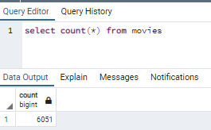
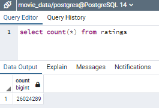

# Extract Transform and Load 
## Project overview:
Create an automated pipeline that takes in new data, performs the appropriate transformations, and loads the data into existing tables.  
Using Python and PostgreSQL, extract movies data from wikipedia and kaggle, transform datasets by cleaning data and merging the multiple datasets and create a PostgreSQL database which gets updated automatically.  

## Software used
- Jupyter notebook
- PostgreSQL

## Final results
A table called movies and another called ratings is created in the database  
  

